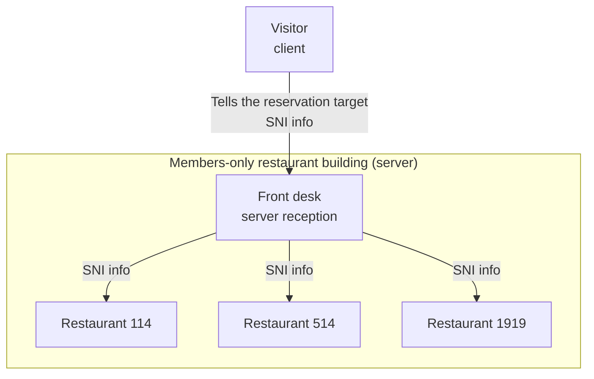
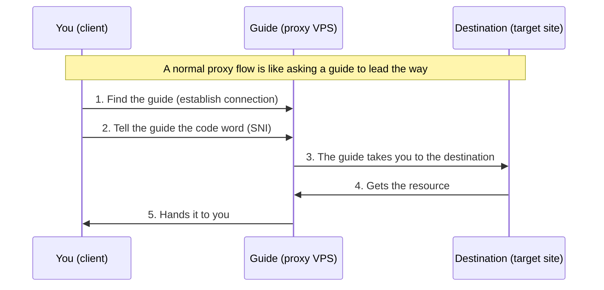
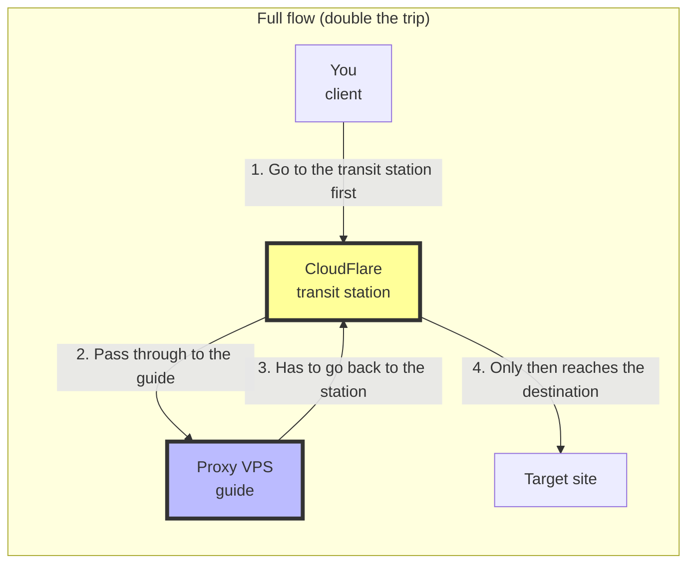
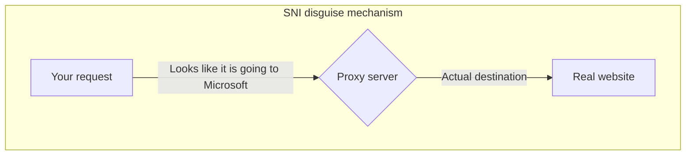
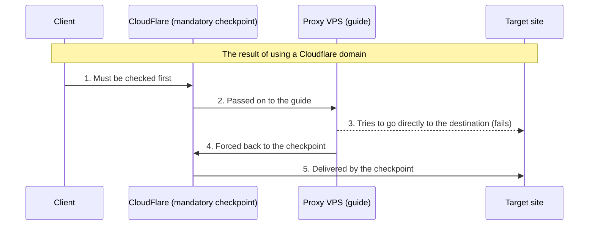
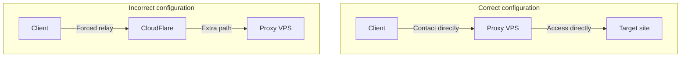

<!-- hash: manual_translation -->

> This article is translated from the Chinese original.

## 1. The basic idea of SNI

Imagine a members-only restaurant building:

- There are many different restaurants inside the building (multiple websites)
- SNI is like your reservation information ("I am going to restaurant xx")
- The front desk uses that reservation to guide you to the right restaurant

## 2. Normal proxy flow

Think of it like this: you want to reach a place that can only be accessed through tunnels (the target site), so you hire a local guide (the proxy VPS) to help you get there.

## 3. Cloudflare hijacking flow

Now imagine that your guide works at a transit station called Cloudflare, so everyone has to check in there first.

### 3.1 Traffic cost explanation

It is like a place that used to take only one trip to reach:

- Now you must report to the transit station first
- Then go from the transit station to the guide
- Then the guide has to bring you back to the transit station
- Only after that can you reach the final destination

As a result:

- The guide has to travel twice the distance (proxy VPS traffic doubles)
- The route becomes longer (higher latency)
- The cost increases (more bandwidth expense)

## 4. The SNI disguise mechanism

SNI disguise is like:

- You hold a special "passport" (SNI)
- On the surface it says you are going somewhere ordinary, such as `microsoft.com`
- In reality it is a code used to pass through a special channel

## 5. Why does Cloudflare hijack the traffic?

Imagine Cloudflare as a mandatory checkpoint:

- If you use their label (a Cloudflare domain)
- Then all related traffic must pass through them for inspection
- It cannot take another direct path

## 6. Best practice suggestions

To avoid this situation, you should:

1. Use a domain that is not proxied by Cloudflare
2. Or use direct IP connections
3. Avoid unnecessary relays

## Core takeaways

1. SNI is the "reservation information" for accessing a website
2. A proxy service is like asking a "guide" to lead the way
3. A Cloudflare domain can force traffic to take a detour
4. That detour doubles the traffic consumption
5. Choosing the right SNI helps avoid these problems
